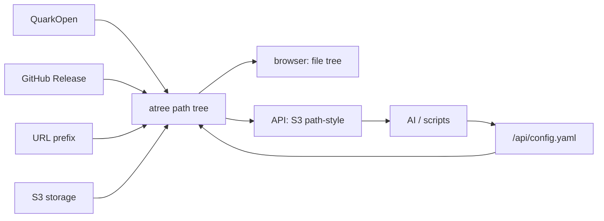

# atree

AI 友好的文件树网关。

atree 把不同后端挂成同一棵树：浏览器访问时是文件树界面，API 访问时是 S3 path-style 协议。配置本身也是树上的一个文件，适合 AI 直接读写 `/api/config.yaml` 来管理 mount、key 和权限。权限模型保持极简：本地 key、allow-list rule、默认拒绝。



## Docker

```bash
docker run --rm \
  -p 9000:9000 \
  -e ATREE_ROOT_KEY='replace-with-root-key' \
  -e ATREE_DB='/data/atree.sqlite' \
  -v atree-data:/data \
  ghcr.io/wangzexi/atree:latest
```

## 配置入口

```bash
curl -H 'Authorization: Bearer <root-key>' \
  'http://127.0.0.1:9000/api/config.yaml' > config.yaml

curl -X PUT \
  -H 'Authorization: Bearer <root-key>' \
  --data-binary @config.yaml \
  'http://127.0.0.1:9000/api/config.yaml'
```

最小 `config.yaml` 骨架：

```yaml
s3_bucket: atree
mounts:
  - mount_path: /api/config.yaml
    type: system_config
auth:
  keys:
    - name: admin
      plain_key: fa17258e88926697fffd6be6aedc912e609b612ecffbc256
  rules:
    - principal: key:admin
      actions: [ListBucket, HeadObject, GetObject, PutObject, DeleteObject]
      resources: [/*]
    - principal: anonymous
      actions: [ListBucket, HeadObject, GetObject]
      resources: [/public, /public/*]
cache:
  enabled: true
  ttl_seconds: 600
```

完整配置注释由代码生成：看 `src/config.rs` 的 `config_yaml_comments()` 和 `validate_config()`。mount 支持类型在 `src/mounts.rs`。QuarkOpen 细节看 `docs/oauth-notes.md`。

## 致谢

感谢 [OpenList](https://github.com/OpenListTeam/OpenList)。atree 的 mount 设计参考了 OpenList 的 driver 架构及相关 driver 逻辑，其中 QuarkOpen 部分重点参考 `drivers/quark_open`。

## 协议

MIT
