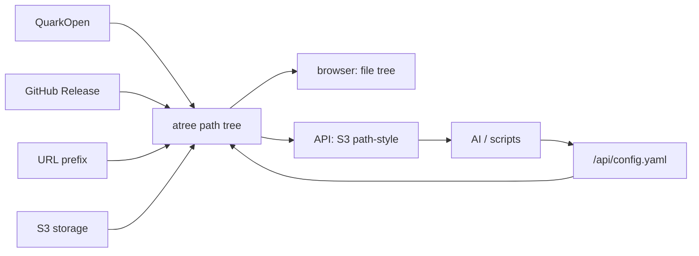

# atree

适合个人自托管且 AI 友好的文件树 S3 网关。

特点：

- 多个后端挂成一棵路径树。
- 浏览器访问是文件树界面。
- API 访问是 S3 path-style 协议。
- 配置也是树上的文件：`/api/config.yaml`。
- 权限模型只有用户、路径和动作。



## Docker

```bash
docker run --rm \
  -p 9000:9000 \
  -e ATREE_ROOT_KEY='root1234' \
  -e ATREE_DB='/data/atree.sqlite' \
  -v atree-data:/data \
  ghcr.io/wangzexi/atree:latest
```

## 配置入口

```bash
curl -H 'Authorization: Bearer <root-key>' \
  'http://127.0.0.1:9000/api/config.yaml' > config.yaml

curl -X PUT \
  -H 'Authorization: Bearer <root-key>' \
  --data-binary @config.yaml \
  'http://127.0.0.1:9000/api/config.yaml'
```

最小 `config.yaml` 骨架：

```yaml
bucket: atree
mounts:
  - type: system_config
    path: /api/config.yaml
  - type: s3
    path: /public
    root_path: /
    options:
      endpoint: https://s3.example.com
      bucket: public
      access_key: key12345
      secret_key: sec12345
users:
  - name: public
    key: public01
rules:
  - user: root
    paths: [/, /*]
    actions: [ListBucket, HeadObject, GetObject, PutObject, DeleteObject]
  - user: anonymous
    paths: [/]
    actions: [ListBucket]
  - user: public
    paths: [/public, /public/*]
    actions: [ListBucket, HeadObject, GetObject, PutObject]
cache:
  enabled: true
  ttl_seconds: 600
```

`root` 来自 `ATREE_ROOT_KEY`，不用写进 `users`。`rules` 只授权；可写路径还需要实际可写 mount。

完整配置注释由代码生成：看 `src/config.rs` 的 `config_yaml_comments()` 和 `validate_config()`。Driver 配置看 `src/drivers/*.rs`。

## 致谢

- [OpenList](https://github.com/OpenListTeam/OpenList)

## 协议

MIT
