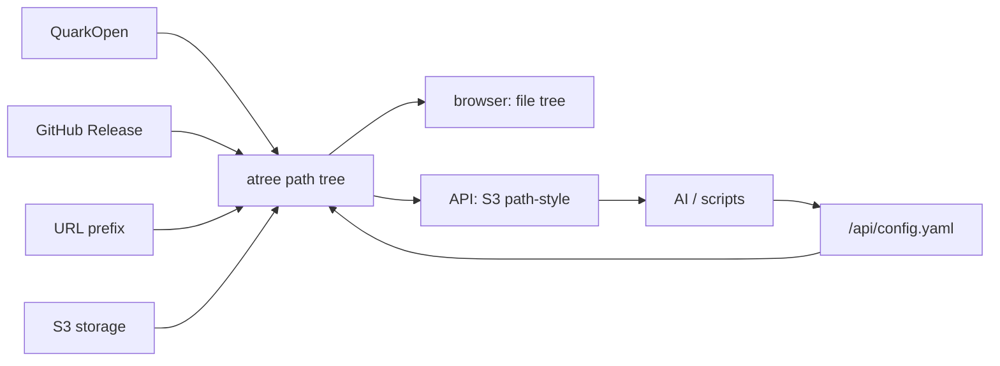

# atree

给个人使用的 AI 友好文件树网关。

特点：

- 多个后端挂成一棵路径树。
- 浏览器访问是文件树界面。
- API 访问是 S3 path-style 协议。
- 配置也是树上的文件：`/api/config.yaml`。
- 权限模型只有用户、路径和动作；默认拒绝。



## Docker

```bash
docker run --rm \
  -p 9000:9000 \
  -e ATREE_ROOT_KEY='11525b32eccbdb118df09f60cfe28061b2665fe7a6635ecf' \
  -e ATREE_DB='/data/atree.sqlite' \
  -v atree-data:/data \
  ghcr.io/wangzexi/atree:latest
```

## 配置入口

```bash
curl -H 'Authorization: Bearer <root-key>' \
  'http://127.0.0.1:9000/api/config.yaml' > config.yaml

curl -X PUT \
  -H 'Authorization: Bearer <root-key>' \
  --data-binary @config.yaml \
  'http://127.0.0.1:9000/api/config.yaml'
```

最小 `config.yaml` 骨架：

```yaml
s3_bucket: atree
mounts:
  - type: system_config
    path: /api/config.yaml
users:
  - name: public
    key: f834a310973c0f615cff59f4a692d535e7a0ef7f69059c30
rules:
  - user: root
    paths: [/, /*]
    actions: [ListBucket, HeadObject, GetObject, PutObject, DeleteObject]
  - user: anonymous
    paths: [/]
    actions: [ListBucket]
  - user: public
    paths: [/public, /public/*]
    actions: [ListBucket, HeadObject, GetObject, PutObject]
cache:
  enabled: true
  ttl_seconds: 600
```

完整配置注释由代码生成：看 `src/config.rs` 的 `config_yaml_comments()` 和 `validate_config()`。Driver 配置看 `src/drivers/*.rs`。

## 致谢

感谢 [OpenList](https://github.com/OpenListTeam/OpenList)。atree 的 mount 设计参考了 OpenList 的 driver 架构及相关 driver 逻辑，其中 QuarkOpen 部分重点参考 `drivers/quark_open`。

## 协议

MIT
